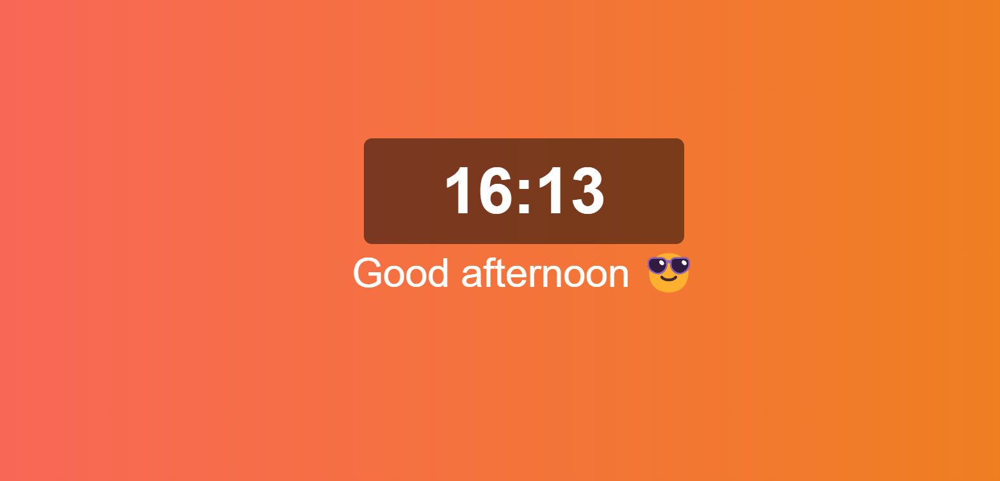

# Current Time - Project



## Sobre o projeto

Esse foi um projeto simples para testar meus conhecimentos sobre React, além de usar duas Hooks (useState e useEffect), e esse projeto foi estilizado em Styled Components, usando as props para tornar as cores de fundo dinâmicas com o horário.

## Tecnologias

- JavaScript
- React.js
- Styled Components

## Rodando o projeto

É sempre bom lembrar que para iniciar o projeto, é necessário que o Node.js esteja instalado na sua máquina, além do Git, para conseguir clonar o projeto! Caso você já tenha instalado, basta seguir os passos abaixo:

```bash
# Para clonar o projeto adequadamente
$ git clone https://github.com/JoaoAlves20/current-time.git

# Entrar na pasta
$ cd current-time

# Baixar as dependências usando yarn
$ yarn
# Ou baixar as dependências usando npm
$ npm i

# Rodar o projeto usando yarn
$ yarn dev
# Ou rodar usando npm
$ npm run dev
```

Após isso, basta verificar no terminal que já terá uma URL para clicar, geralmente sendo usada a http://localhost:3000